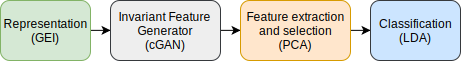
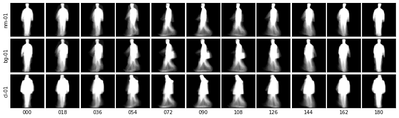
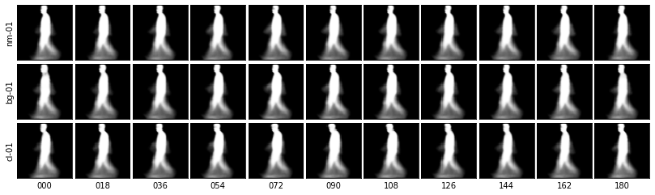
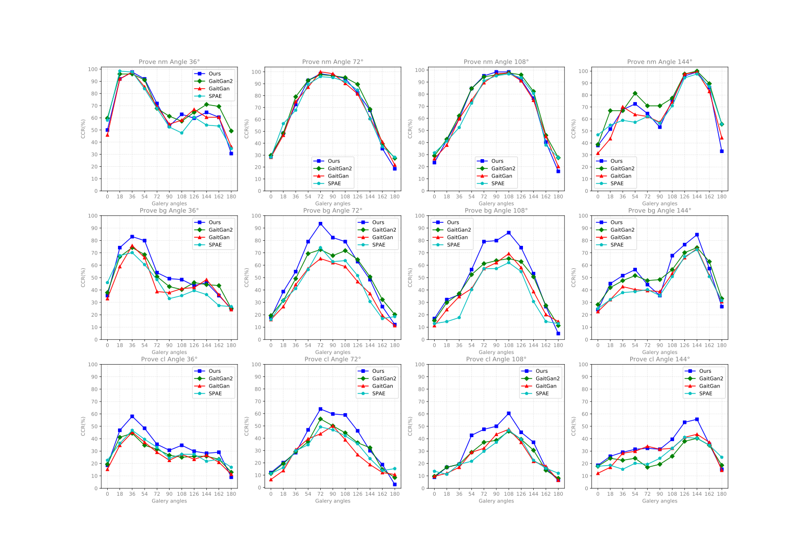

<h1 align="center">  Cross-View Gait Recognition Based on U-Net  </h1>
<p align='right'><i>  Updated: April 27th, 2021 </i></p> <div align="center">
  <a href="#Description"><b>Description</b></a> |
  <a href="#Our approach"><b>Our approach</b></a> |
  <a href="#Results"><b>Results</b></a> |
  <a href="#Getting Started"><b>Getting Started</b></a> |
  <a href="#Citing"><b>Citing</b></a>
</div>

<p align="center">
  
</p>
<p align="center" >
 <i>Example of invariant Gait Energy Image (GEI) generation.</i>
</p>
# Description
Inspired by the great successes of GANs in image translation tasks, we propose a new gait recognition technique by using a conditional generative model to generate view-invariant features. The proposed method is evaluated on one of the largest datasets available under the variations of view, clothing and carrying conditions: CASIA gait database B. Experimental results show that the proposed method achieves an outstanding correct classification rate and outperformed state-of-the-art methods specially in carrying-bag and wearing-coat sequences.

In this work, we propose a method of gait recognition using a conditional generative model to generate view-invariant features and overcome appearance variations due to changes of clothing, carrying conditions, and view angle.

# Our approach
## Framework
<p align="center">
  
</p>
<p align="center" ><i>Example of invariant Gait Energy Image (GEI) generation.</i></p>

## Conditional GAN (CGAN)

|  Generator |  Discriminator
|---|---|
| <!-- .element: style="text-align:center;" -->| <!-- .element: style="text-align:center;" -->|


# Results

Next, some qualitative results are shown:

<p align="center" ><i>Original GEI representations for the subject 120 on the CASIA-B dataset. Notice that we are showing all the view-angles for three sequences: nm-01, bg-01, and cl-01.</i></p>



<p align="center" ><i>Generated GEI representations for the same subject</i></p>

<p align="center"></p>
<p align="center" ><i>Generated GEI representations from multiple subjects on each training step</i></p>

However, it is necessary to compare our results with other state-of-the-art works.


<p align="center" ><i>Comparison with other approaches based on the correct classification rate (CCR)</i></p>

# Getting Started

You can find the notebook [here](notebooks/Gait_U_Net2.ipynb) or open it at [](https://colab.research.google.com/drive/1GXSScKJ5uOJLZ-9aseO3vXLYen_DLJ9p#forceEdit=true&sandboxMode=true)

### Prerequisites

```
- Tensorflow 2.x
- Keras
- OpenCV
- Numpy
- Matplotlib
```

## Built With

* [CASIA](http://www.cbsr.ia.ac.cn/english/Gait%20Databases.asp) - The dataset used
* [Pix2Pix](https://www.tensorflow.org/tutorials/generative/pix2pix) - Based on
* GoogleColab - The virtual machine used in the experiments

# Citing

Please, cite this work as follows:
```
I. R. Tiñini Alvarez and G. Sahonero-Alvarez, "Cross-View Gait Recognition Based on U-Net," 2020 International Joint Conference on Neural Networks (IJCNN), Glasgow, United Kingdom, 2020, pp. 1-7, doi: 10.1109/IJCNN48605.2020.9207501.
```

## Acknowledgments

This work has been inspired on:
* [Image-to-Image Translation with Conditional Adversarial Networks](https://arxiv.org/abs/1611.07004)
* [U-Net: Convolutional Networks for Biomedical Image Segmentation](https://arxiv.org/abs/1505.04597)

The following articles have been used to compare our approach
* [GaitGANv2: Invariant Gait Feature Extraction Using Generative Adversarial Networks](https://www.researchgate.net/publication/328377402_GaitGANv2_Invariant_Gait_Feature_Extraction_Using_Generative_Adversarial_Networks)
* [GaitGAN: Invariant Gait Feature Extraction
Using Generative Adversarial Network](https://openaccess.thecvf.com/content_cvpr_2017_workshops/w6/papers/Yu_GaitGAN_Invariant_Gait_CVPR_2017_paper.pdf)
* [View invariant gait recognition using only one uniform model
](https://ieeexplore.ieee.org/abstract/document/7899748)

## Authors
* [Israel Tiñini Alvarez](mailto:ir.tinini@acad.ucb.edu.bo)
* [Guillermo Sahonero-Alvarez](https://www.imt.ucb.edu.bo/cidimec/people/sahonero/)
